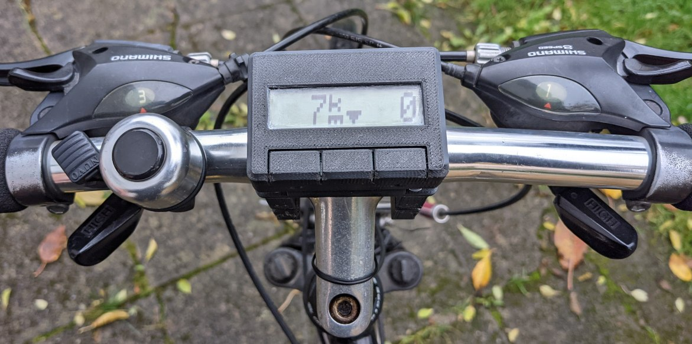
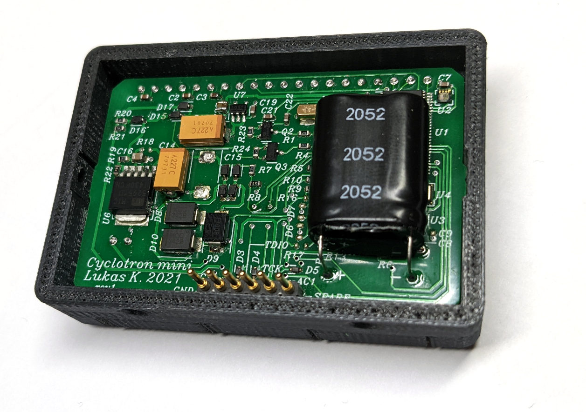
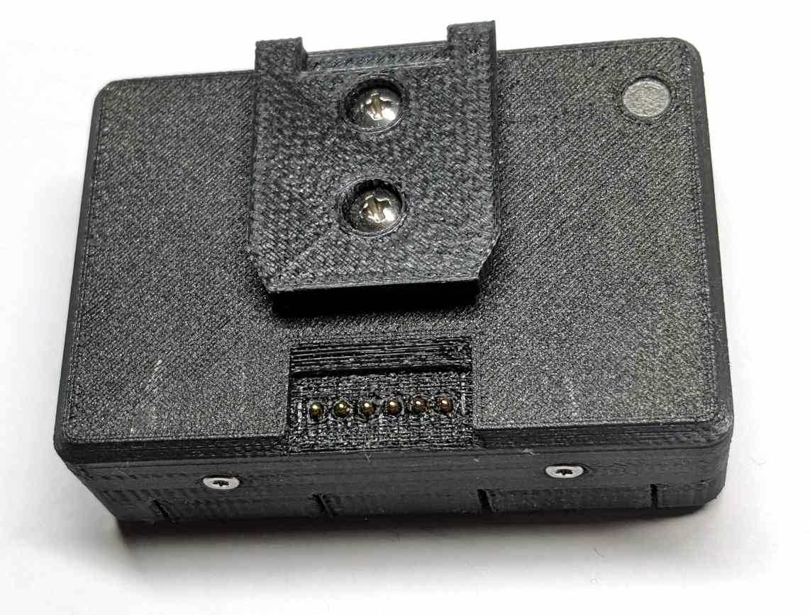
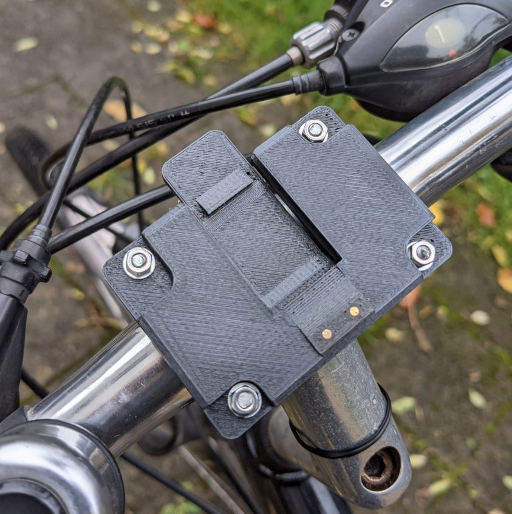
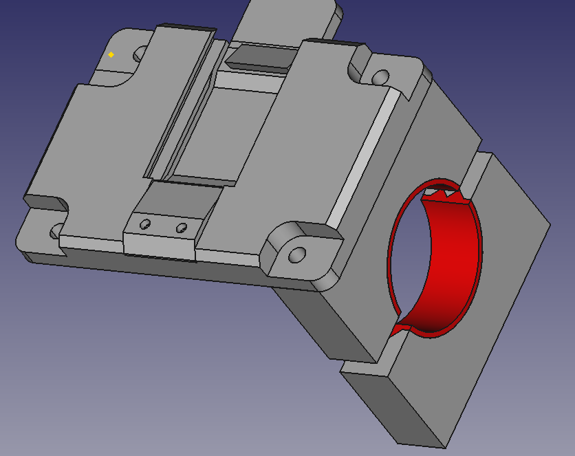
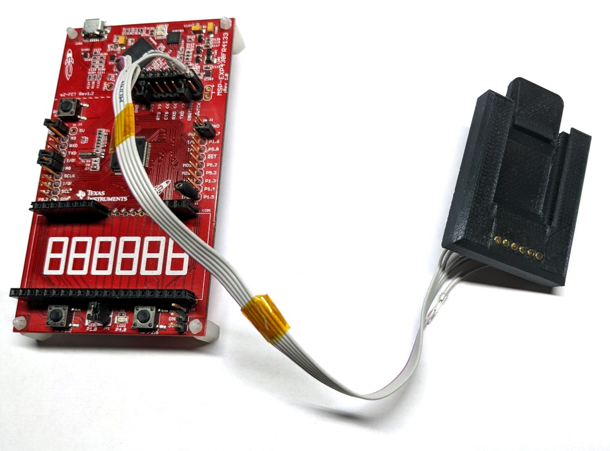

The Cyclotron mini is a battery-less cyclocomputer that uses a hub 
dynamo for both power supply and speed measurement.

# Motivation and key ideas

As I frequently ride my bike after sunset, I needed a cyclocomputer 
that's readable in the dark, i.e. has an illuminated display. This 
rules out devices powered from a non-rechargeable coin cell as a 
backlight would lead to unsatisfactory battery life. I also didn't want 
yet another gadget that needs to be charged.

Fortunately, proper bikes these days come equipped with a hub dynamo 
that provides an always-on power supply at low mechanical resistance. 
Apart from power, a hub dynamo also provides accurate speed and 
distance measurements since its output frequency is directly linked to 
the tire's rotation.

# Features and facts

 - All of the usual cyclocomputer features
   - Speed
   - Distance
   - Max. speed
   - Average speed
   - Time in motion
   - etc.
 - Stores the last 15 trips
 - Trip-independent distance accumulator
 - Backup power provided by 1.5F supercapacitor
 - Barometer for altitude measurement
 - Backlit 8 character LCD that's also readable in sunlight
 - 3 buttons (Ok, Down, Up)
 - Ambient light sensor for automatic backlight control
 - MSP430FR4133 MCU
 - Closed-case firmware updates

# Hardware

As usual, the PCB layout was done in [Horizon EDA](https://horizon-eda.org/) 
and boards were ordered from JLCPCB. The components got soldered on a 
cheap electric hotplate after applying solder paste with a stencil.

[PDF schematics](hw/output/schematic.pdf)

## MCU

The Cyclotron mini is based on the MSP430FR4133 MCU. It has way more 
pins than actually needed, but I had one spare and it's still available 
amidst the great chip shortage.

## LCD

The LCD is a [DOGM081-A](https://www.lcd-module.de/produkte/dog.html) 1×8 character LCD with amber backlight. I went with a character 
display rather than a graphical one as these require 
MCUs with large program memory and RAM to store fonts and framebuffer 
respectively. Apart from that, a character LCD effectively limits firmware 
feature creep such as graphs.

The backlight LEDs are rated to run at 80mA, anyhow they provide 
sufficient illumination at around 2mA. Since the the LCD is a 
transreflective one, the backlight is only required when it's dark and 
thus doesn't need to be all that bright.

Unfortunately, this particular display doesn't support any meaningful 
low-power (<1µA) standby modes, so it's powered from an IO pin.

## Power supply

The AC voltage from the dynamo is clamped to about ±7V by two 
antiserial zener diodes D8 and D9. The 170V TVS diode 
D9 provides some additional transient protection. It's probably not 
really necessary, I only included it as other people were using similar 
protection on their dynamo powered circuits.

The LDO U6 regulates the rectified and smoothed voltage to 5.2V to 
charge the 1.5F backup capacitor via a 50 Ohm (actually 2 100 Ohm in 
parallel) series resistor. I did some simulations with various current 
source circuits to charge the capacitor faster, but couldn't come up 
with one that worked significantly better than a simple 
current-limiting resistor. D16 prevents the capacitor from discharging 
into the unpowered LDO.

When there's power from the dynamo, but the supercapactior voltage 
still is too low, D15 and D17 provide a bypass to power the device 
while the supercapacitor is charging.

Finally, the LDO U7 regulates the bus voltage to 3.3V as it's required 
by the rest of the circuitry. The BOM lists an ADP162AUJZ-3.3 from 
Analog Devices, but an an S-1313C33-M5T1U3 by ABLIC with lower 
quiescent current is a pin-compatible drop in replacement that I ended 
up using.

To measure the capacitor and bus voltage without loading them too much, 
they can be momentarily connected to a voltage divider by the P-channel 
MOSFETs Q2 or Q3. The RC circuit provides the level shifting to turn on 
the transistors. I got that idea from [Mike Harrison's 2017 Supercon badge](https://youtu.be/2WY3O26YYl8?t=1282).

It turned out that standby time (with the LCD off) is mostly determined by the leakage of 
the schottky diodes surrounding the supercapacitor, leading to a 
current consumption of about 8µA which will deplete the supercapacitor 
in about 4 days. It might be worth experimenting with non-schottky 
diodes or parts with lower leakage to extend that time.

Without backlight, the idle current consumption is about 150µA.

## Cycle counting

The hardware has provision for three ways to count the cycles of the AC 
signal generated by the dynamo as it's needed for speed and distance 
measurement.

### Digital inputs

Measurements confirmed that the dynamo produces its nominal voltage well below 
10 km/h, so the simplest way to count cycles is 
directly connecting the AC signal to digital inputs of MCU with series 
resistors and clamping diodes. As this method provided good results, 
it's the one I ended up using.

### ADC measurement

In case the above approach didn't work for some reason, the selected 
MCU pins can also be multiplexed to its internal ADC.

### Comparator

If all of the above methods would have failed, there's provision for a 
low-power comparator to turn the AC signal from the dynamo into a 
logic-level signal to be processed by the MCU.

## Barometer

The go-to barometric pressure sensor these days appears to be the 
BMP280 by Bosch, at least judging by what's available as modules for 
makers. Unfortunately, it's apparently a victim of the 2021 chip 
shortage and impossible to get hold of.

Instead, I went for the 
[MS563702BA03](https://www.te.com/usa-en/product-MS563702BA03-50.html) by TE connectivity. It's connected 
to the MSP430's I²C peripheral. Since it consumes less than 100nA when 
not doing measurements, it can be directly connected to the always-on 
3.3V power supply.

It's I²C interface is a bit odd as it doesn't use repeated starts for 
reads requiring an address. It also doesn't provide any means to poll 
if a conversion is still in progress, instead one has to wait for the 
expected conversion time and hope that that's been long enough since 
reading the result too early corrupts the measurement. At least the 
result will be 0 to indicate that it's not valid.

Since there still was sufficient space on the board, there's provision 
for using the BMP280 instead.

## Ambient light sensor

Influenced by part availability I picked the ambient light sensor 
[LTR-329ALS-01](https://optoelectronics.liteon.com/upload/download/DS86-2014-0006/LTR-329ALS-01_DS_V1.5.PDF)
made by LiteOn. Same as the LCD, it doesn't have any useful sleep modes, 
so it's also powered from an IO pin. This meant that it couldn't share 
the I²C bus with the barometer as its clamping diodes would have 
adversely affected the bus. As there's only one I²C peripheral in the 
MCU, its I²C bus is bit banged.

## Bike and programming interface

To provide a reliable electrical connection to the mount on the handelbars, the 
Cyclotron mini uses a [6-pin spring loaded 
header](https://www.mill-max.com/products/datasheet/sockets/816-22-006-10-009101), the 
The remaining 4 pins are 
used for programming and one spare pin. The header is kind of expensive 
at around 5€, but works really well. As the pins are exposed, they're 
protected by ESD protection diodes.

## Bugs

As always, there were some minor goof-ups:

 - The footprint for the MIC5295 voltage regulator appears to have slightly incorrect pin spacing
 - The display overlaps the top pad of the buttons by a little bit

# Firmware

The overall architecture is very similar to the 
[Pluto digital watch](https://github.com/carrotIndustries/pluto-fw), 
with some simplifications here and there. The MCU spends most of its time in 
LPM3 sleep mode and is woken up about every millisecond (1/1024Hz) by a timer interrupt. 
The interrupt handler reads the button state and handles debouncing. If 
a button was pressed, the low power mode is left and the main loop 
resumes. It also counts the pulses generated by the dynamo.
To periodically refresh the display, the interrupt handler 
also leaves low power mode every second.

The main loop then figures out why it got woken up, populates an event 
mask with the according event and calls the top-level event handler. 
This one then dispatches the event to the current view as well as other 
subsystems.

Same as pluto, the firmware is built using the msp430-elf GNU toolchain 
and a simple makefile. Enabling link-time optimisation helped to 
eliminate getter/setter functions in the resulting binary and reduced 
code size by about 1000 bytes.

## LCD

The firmware maintains an 8-character "framebuffer" that is flushed to 
the display once the current view is done drawing. This ensured flicker-free 
display updates. The LCD's hardware cursor comes in handy to indicate 
the current digit when adjusting values.

Symbols such as °C and km are displayed using custom characters to save 
space on the screen.

## Tachometer

The 1024Hz timer interrupt handler calls a function that reads the 
state of the two pins that sense the AC signal generated by the 
dynamo. For increased robustness, a pulse is only counted if a rising 
edge is detected on the other pin than the prior one. The 
accumulated pulse counter is then used by other code for 
calculating speed and distance. Overflows of this counter don't matter 
as other code only considers its difference between two points in 
time.

The current speed is calculated every second based on the pulse count 
difference, counts per revolution and tire circumference.

Distance is accumulated by another pulse counter that counts modulo the 
counts per revolution. When it overflows, the tire circumference is 
added to the millimeter accumulator. That one in turn counts modulo 
1000mm, and adds one to the total distance in meters on overflow.

## Barometer and altimeter

Calculating air pressure from the uncalibrated 24-bit pressure and 
temperature ADC readings provided by the sensor unfortunately involves 
64bit math that consumes around 1000 bytes of program memory. 

To avoid waiting for the conversion to finish, the ADC conversion 
result is only read in the next one-second tick, also eliminating the 
possibility of not waiting long enough and corrupting the measurement.

The 
[formula](https://de.wikipedia.org/wiki/Barometrische_H%C3%B6henformel#Internationale_H%C3%B6henformel) to calculate
altitude from air pressure looks quite intimidating to implement on an 
an MCU without floating point unit. However, a reasonable approximation 
can be made if the relative altitude change is small since the slope 
can be considered constant in that case. 

As it turns out the derivative of the altitude only consists of 
elementary arithmetic after plugging in the reference pressure 
calculated from known pressure altitude and simplifying the equation.

## Ambient light sensor

The datasheet of the ambient light sensor doesn't provide a formula for 
calculating the illuminance from the ADC readings, but  we only need 
a threshold for turning on the backlight, this doesn't matter that 
much. Even though the sensor contains two channels tuned to different 
parts of the spectrum, using channel 0 proved to be sufficient. 

## Power management

To conserve power when the device is off, LCD and ambient light sensor 
are powered down and the MCU only only wakes up at rate of 4Hz to check if 
any button got pressed or the dynamo generated any pulses.

# Construction

All parts have been designed in FreeCAD and were printed on a 
FlashForge creator pro 3D printer using PLA filament and TPU for 
semi-flexible parts. Finally some good use for the dual extruder!

### CAD files

Due to licensing restrictions, the CAD files available in the `mech` 
directory don't contain the 3D models of certain components.

Even though each file contains all parts, only use the ones that are 
visible.

## Case

The overall concept of the case is similar to the [Hubble SFP 
multitool](https://github.com/carrotIndustries/hubble/). The main 
circuit board is located by the two halves of the case, 
eliminating the need for screws or the like that'd consume space on the 
circuit board. Both halves are held together by 4 M2×8 
(×6 works as well) torx screws threaded into the inner shell. As they don't 
have so support any axial forces, there's no need for metal inserts or 
nuts.

The ambient light sensor gets to see the outside world through a light pipe 
pressed into the rear shell.

Same as with Hubble, the key caps are integral to the case, eliminating 
any chance of rattling. Thinning the front wall provides the required 
flexibility. The low pivot point of the mechanism makes it possible to to press the 
keys from the front rather than just straight on.

A case that's waterproof around the keys is currently work in progress.

## Mount

Central part of the mount is a dovetail-shaped piece that's affixed to 
the rear shell with two self-tapping screws (see above). It slides into the part 
that's mounted to the handlebars and locks into an integral 
retaining clip with a satisfying click.

The mount itself is attached to the handlebars by means of 4 u-shaped 
clamps that are held together using threaded rod as I couldn't find 
screws long enough. To provide better grip, the inside surface of the 
clamps (shown in red) is printed using semi-flexible TPU filament.

## Electrical interface

The spring loaded pins from the main board mate with 
[targets](https://www.mill-max.com/products/pin/3024) pressed 
into the mount. The targets are installed by first fiddling the cable 
through the hole in the mount, soldering it to the target and then pressing it in 
using pliers. 

## Development mount

For easy firmware updates and debugging, there's a variant of the 
dovetail receptacle with all targets populated. They're connected to 
the 5V and Spy-Bi-Wire pins of an MSP430 evaluation board.

# Issues and Pull Requests

Unlike [software projects](https://github.com/horizon-eda/horizon), 
hardware projects like this one reach a state of completion once I'm 
happy with what it's doing. After that, I usually don't have much interest in 
continued development and move on to new projects. So don't expect me 
to review and merge pull requests. Happy forking!
